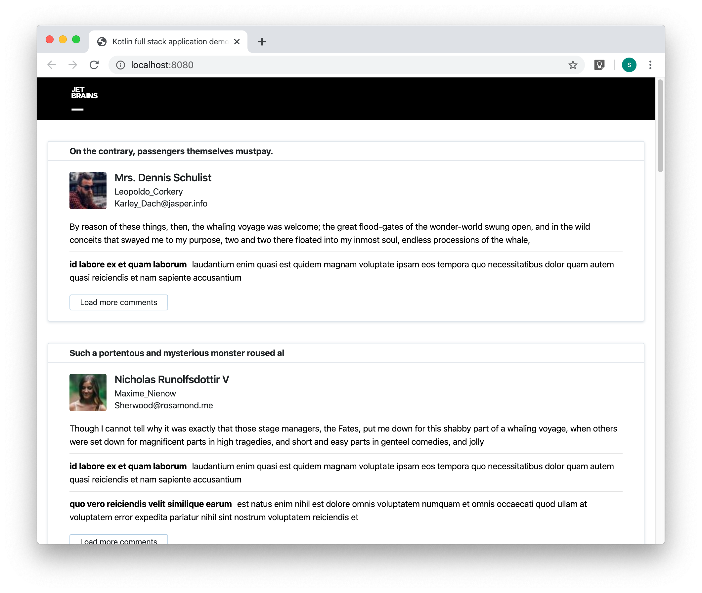

# kotlin-full-stack-application-demo

Fork of https://github.com/mkraynov/kfsad with the new Kotlin/JS Gradle Plugin

A full-stack demo application written in Kotlin for [JetBrains Night Moscow 2019](https://info.jetbrains.com/jetbrains-night-moscow-2019).

## Run application

- `./gradlew :server:run` will build optimized application bundle and run it on https://localhost:8080 (it takes some time to build optimized js bundle, so it is not useful for development)
- **NOT IMPLEMENTED YET** `./gradlew :client:run -t` will run development application at https://localhost:8080 with live reload. It runs ktor and webpack dev servers under the hood:
    - Webpack dev server will be run at the front https://localhost:8080. Webpack dev server will call ktor for everything expect client.js. This is required for dealing with CORS
    - Ktor server will be spawend internally at https://localhost:8081
    
## Distribution

- `./gradlew :server:build` will create `server/build/distributions/server-0.1.1.zip`. You can deploy it on the server and run `bin/server` to start the server. Client is included into the `lib/server.jar` 

## Description

This application displays a feed containing user-generated posts and comments. All data is stubbed by the fakeJSON and JSON Placeholder services.

It is a [Kotlin Multiplatform](https://kotlinlang.org/docs/reference/multiplatform.html) project.

It uses:
- `kotlin-multiplatform`, `kotlin-js` and `kotlin-jvm` plugins for Kotlin compilation;
- [Ktor framework](https://ktor.io) as a web server;
- [H2](http://www.h2database.com/html/main.html) in-memory database with [Exposed](https://github.com/JetBrains/Exposed) to preload posts at application startup;
- [kotlinx.serialization](https://github.com/Kotlin/kotlinx.serialization) for client/server (de-)serialization and RPC;
- [React](https://reactjs.org), [Styled components](https://www.styled-components.com), [Ring UI 2.0](https://jetbrains.github.io/ring-ui/develop-2.0/index.html) and [kotlin-wrappers](https://github.com/JetBrains/kotlin-wrappers) for rendering. 

During application startup posts are preloaded to the in-memory database from the fakeJSON (or JSON Placeholder) service. 
When the user requests the page, several posts are selected from the DB and the corresponding comments are fetched via the multi-platform HTTP client.
Posts with comments are served to the client via RPC. After the initial render is done, information about authors is fetched via the client-side HTTP client and rendered after all coroutines terminate successfully.
The "Load more comments" button fetches additional comments for the post using the multi-platform HTTP client.

This application has no error handling and has very limited RPC serialization. It's not meant for production use and serves only as a technology example.

### Contact information

Please refer original repo: https://github.com/mkraynov/kfsad